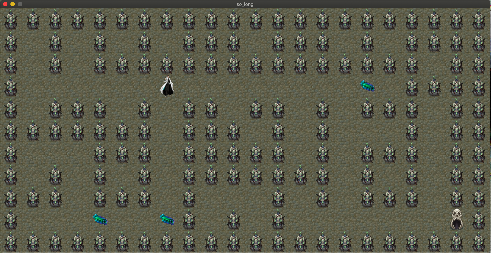

# 🎮 so_long

> A simple 2D graphical game built with C and the MiniLibX graphics library as part of the 42 curriculum.

---

## 📌 Project Description

The goal of this project is to create a basic 2D game using the **MiniLibX** graphical library where the player navigates a map to collect all collectibles and reach the exit.  
It focuses on **file parsing**, **2D rendering**, **basic animation**, and **event handling**.

---

## 🛠️ Build Instructions

### 🔹 Clone the repository

```bash
git clone https://github.com/yourusername/so_long.git
cd so_long
```

### 🔹 Install MiniLibX (if you haven't already)
If you're using macOS and don't have mlx or cmake yet, install them with:
```bash
brew install glfw
brew install cmake
```
Make sure to have mlx available in the mlx/ folder or linked accordingly.


### 🔹 Compile the Project
To build the mandatory part:
```bash
make
```

To build the bonus version:
```bash
make bonus
```

🎮 How to Play
After launching the game, use the following controls:

| Key     |       Action    |
|---------|-----------------|
|    `W`  |   Move Up       | 
|    `S`  |   Move Down     |
|    `A`  |   Move Left     |
|    `D`  |   Move Right    |
|   `ESC` |   Exit the game |


✨ In the bonus version, you might also get:

✅ Animations

✅ Enemy behavior

✅ More detailed UI


### Objectives
 - Parse and validate a map file

 - Handle player movements

 - Track collectibles

 - Exit only when all collectibles are picked

 - Bonus: animation and enemy movement


## Screenshots

### Mandatory Game


### Bonus Game


 ### 🧑‍💻 Author
 Made with ❤️ by Kaltoum


